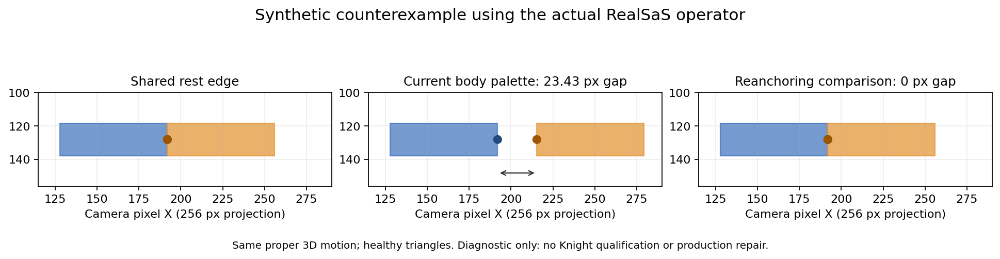

# Spine runtime comparison: presentation continuity remains open

Date: 2026-10-09. Classification: source audit and local diagnostics only.
This document does not issue research qualification, repair an execution ledger,
promote a ProductRevision, or close PR #66. Production code is unchanged.

The concrete finding is a structural discontinuity in the current presentation
pose palette. Two pieces undergoing the **same proper rigid 3D transform** can
map their shared joint to different screen positions. Healthy individual
triangles and native/reference byte parity cannot detect this relation failure.
Spine provides useful contracts for closing that gap: a coherent 2D hierarchy,
explicit binding data, and independently controlled drawing order.

## Evidence and its boundaries

The completed downstream Attempt is `707e3b9b-91c6-4247-97dc-02b52ba0164a`,
EngineRelease `a94141fa-87b8-4c82-9e18-624e71b2e628`, compiler run
`KNIGHT_PRESENTATION_P0_FE8FB14842364D53A22A573CA3B97357`.
Immutable execution code is `b936454362a7f5dcdba53920c6aa88a936bf508b`.
The inspected checkout before this audit is `24c2af599be9934e620bb45c2f04cc5e1405b42d`,
whose later changes concern the private-input handoff.
[Hosted run 37900739694](https://github.com/merynz/RealSaS-OPT/actions/runs/37900739694)
completed Stage37/42/43/44/45. Stage45 reports `PASS_DEMO_ONLY` over 984 frame-views:
zero native/reference mismatch frame-views, area/condition failures, flipped
triangles, edge ratios above 4, unresolved depth ties, fragment overflow and empty
frame-views. Actual attachment XY/depth owner residuals and canonical palette
residual are zero. The carrier-slot relative residual is approximately 0.00017824.
These are the proof's measured predicates, not a visual-quality acceptance.

Projection hash: `642ada9fba5f3a7dc51608a684082daa023140025eda73213b982ef2e20ee593`.
The recovered projection NPZ independently matches SHA256
`a66e61457e4bac89ff044a03b8d7db15642a7f968fe65eaf3be3804f73de81b3`.
The full exported ZIP was not downloaded/hash-verified, and its native raw-frame
files are absent. The following two-frame ablation uses the local Python
reference renderer with the exact projection arrays/source images. It is an
**unqualified diagnostic**, not a new native scientific render.

| RUN frame 0 diagnostic | V6 | V4 |
|---|---:|---:|
| Alpha-byte differences after reversing depth | 0 | 0 |
| RGB pixels changed after reversing depth | 236 | 1400 |
| Body visible pixels after hiding sword/shield | 7522 | 8734 |
| Body triangle union with solid opaque texture | 7523 | 8734 |
| Additional body coverage from removing texture alpha | 1 | 0 |

Visual inspection found large body separations still present when attachment
faces were removed and body triangles were drawn opaque. For these two
frame-views, depth/order changes affect occlusion colors but cannot fill the
missing triangle coverage. This does not exclude attachment occlusion defects
in other frames. Coincident source XY points alone are **not** evidence of a
shared semantic seam: different 3D surfaces may project to the same location.

## Source review coverage

Public runtime code was pinned rather than read from a moving branch:

- Main audit: [Spine 4.3 snapshot](https://github.com/EsotericSoftware/spine-runtimes/tree/1ad4e94bc3f16f4908a87a97d31e0de657f1788a).
- Cross-check of the core hierarchy, weighted vertices and renderer:
  [Spine 4.2 snapshot](https://github.com/EsotericSoftware/spine-runtimes/tree/e7dc1435fa4a0083ab431f1b28e083c14a1f5c68).
- The 4.3 spineboy example used below carries export metadata `4.3.75-beta`;
  that describes the example bytes, not a claim about current release status.

The audit covers the path from exported data through pose, vertex evaluation
and drawing. It is not a claim that every engine wrapper, example, shader
variant, platform integration or private Editor implementation has been read.
The file-level [source ledger](evidence/spine_source_review_v1.json) records deep
and focused review separately. Downloading a file is not counted as reviewing it.

| Contract | Reviewed source paths under the 4.3 snapshot | Review depth |
|---|---|---|
| Immutable setup data and instance pose | `SkeletonData`, `Skeleton`, `BoneData`, `Bone`, `BoneLocal`, `BonePose` | Core implementations |
| Binding and visual vertex motion | `VertexAttachment`, `RegionAttachment`, `MeshAttachment` | Core implementations |
| Slot, equipped attachment and skin | `Slot`, `SlotData`, `SlotPose`, `Skin`, `LinkedMesh` | Core implementations |
| Animation and deformation | `Animation`, `AnimationStateData`, `DeformTimeline`, `AttachmentTimeline`, `Sequence`, `SequenceTimeline` | Core implementations |
| Track mixing and reset | `AnimationState` | Focused update/apply, mixing and attachment trace |
| Object draw order | `DrawOrder`, `DrawOrderTimeline`, `DrawOrderFolderTimeline` | Core implementations |
| JSON/binary input and atlas | `SkeletonJson`, `SkeletonBinary`, `Atlas`, `AtlasAttachmentLoader` | Focused parsing/ownership paths |
| Constraint dependencies | IK, transform, path and physics constraints | Focused update/sort paths; not all solver equations |
| Clipping | `SkeletonClipping`, `Triangulator` | Clip lifecycle/intersection/UV paths; focused triangulation |
| CPU/WebGL rendering | C++ `SkeletonRenderer`; TS `SkeletonRendererCore`, WebGL renderer, batcher, texture, mesh and shader | Core rendering path; focused GPU transport/shader |
| Example authoring data | `examples/spineboy/export/spineboy-pro.json` | Selected hierarchy, slots and attachments |

## What Spine makes explicit

1. **One 2D kinematic hierarchy.** A child's origin is computed by its parent's
   world matrix applied to its local offset. World transforms are evaluated in
   dependency order. Scale/shear and inheritance choices are explicit. This is
   not the independent fitting of one projected 3D transform per joint pivot.
   See [runtime skeletons](https://esotericsoftware.com/spine-runtime-skeletons)
   and `BonePose.cpp`; the same parent-origin rule exists in the 4.2 `Bone.cpp`.

2. **Explicit bind coordinates.** Weighted vertices contain a local XY position
   and weight for each influencing bone. Deform offsets are applied in the
   appropriate bind domain before bone transforms and weighted accumulation.
   Unweighted meshes use the slot bone. Mesh triangles/UVs arrive as data; the
   runtime does not infer a new skin field. See
   [JSON format](https://esotericsoftware.com/spine-json-format) and `VertexAttachment.cpp`.

3. **Relations between separately drawn meshes.** Authoring exposes weight
   matching across meshes with Weld; this can make different images deform
   together. Linked meshes share geometry/binding and optionally deformation
   timeline identity. These mechanisms require appropriate asset data; Spine
   does not guarantee arbitrary disconnected meshes will remain attached.
   See [weights](https://esotericsoftware.com/spine-weights) and `MeshAttachment.cpp`.

4. **Motion owner and drawing owner are distinct.** A slot has a bone and one
   active attachment. Skeleton draw order is a slot permutation, with stepped
   timeline changes. Within a self-overlapping weighted mesh, the editor can
   choose triangle order using bone-weight dominance/order. The reviewed
   renderer consumes the exported index order. It does not replace that order
   with animated mechanical surface Z. See
   [slots](https://esotericsoftware.com/spine-slots), the weights guide and `SkeletonRenderer.cpp`.

5. **Clipping changes drawn support, not kinematic ownership.** A clipping
   attachment starts an explicit clipping interval ending at a named slot.
   Polygon/triangle intersections produce temporary render vertices with
   interpolated UVs. Clipping cannot supply absent body material or reconnect
   separated input geometry. See
   [clipping](https://esotericsoftware.com/spine-clipping) and `SkeletonClipping.cpp`.

6. **Image-space bookkeeping is a separate contract.** Atlas trimming and
   rotation retain original dimensions and offsets; region and mesh UV
   evaluation use them. Texture premultiplication, blend mode, sampler state
   and clipping all matter at edges. Consecutive batches are merged without
   sorting them out of draw order. These issues can explain small fringes;
   the two Knight body ablations do not support them as the sole cause of the
   large missing-coverage regions.

7. **Setup pose is separate from animation time zero.** Loading creates setup
   data; animation application changes the instance. Attachment changes reset
   deform state unless shared timeline identity permits reuse. Track mixing
   has explicit setup/current rules. An unarmed body animation need not contain
   a sword or shield, and its first key is not a target prop placement contract.
   See [applying animations](https://esotericsoftware.com/spine-applying-animations)
   and [runtime skins](https://esotericsoftware.com/spine-runtime-skins).

The spineboy example makes the attachment separation concrete: its `gun` slot
uses a `gun` bone parented to `rear-bracer`, while the gun image has its own
local transform/dimensions. The body hierarchy, equipped art and slot ordering
remain separate data. This is an architecture reference, not a Knight rig to copy.

## Reproducible structural counterexample

Run from the repository root:

```bash
python tools/probe_visual_palette_joint_coherence_v1.py \
  --out /tmp/joint_coherence.json --plot /tmp/joint_coherence.png
```

The fixture uses the actual `evaluate_motion_blend`, canonical palette residual
and triangle metrics. Two adjacent rectangles have separate pure bone weights,
share a joint/edge, and receive identical proper 3D rotation matrices. Their
canonical weighted 3D motion stays continuous. The source camera has a 256 px
resolution and half extent 2. No Knight measurements are used to construct it.

| Case | Shared 3D point residual | Current 2D joint separation | Triangle area ratio / condition |
|---|---:|---:|---|
| Identity | 0 | 0 px | 1 / 1 |
| In-plane rotation 60 degrees | 0 | 0 px | 1 / 1, within roundoff |
| Out-of-plane rotation 60 degrees, flat rest | 0 | 32 px | 1 / 1 |
| Out-of-plane rotation 60 degrees, depth-varying rest | 0 | 23.425626 px | 1 / 1, within roundoff |

The flat case produces relative overlap; the depth-varying case produces an
actual empty band between the two rectangles. Direct projection maps the shared
point identically in every case. Reanchoring the child to the parent's image of
the common point removes the diagnostic discontinuity, but this two-piece
comparison is **not** a general presentation mapping or production repair.



The current operator uses a proper 2D rotation `Q_i` extracted from the 3D
rotation, then translation
`t_i = project(M_i * pivot_i) - Q_i * project(pivot_i)`.
When the 3D motion includes foreshortening/out-of-plane displacement, replacing
the projected linear map by `Q_i` while independently preserving each pivot's
projected position does not preserve joint coincidence. Even identical 3D
matrices can give different translations at different pivots.

This establishes a defect in the **Stage42 presentation pose transport**.
It does not establish that every visible Knight hole has this single cause.
The [JSON result](evidence/joint_coherence_counterexample_v1.json) pins helper
file hashes, records the local NumPy version and labels the fixture
`SYNTHETIC_DIAGNOSTIC_ONLY`. No Stage45 execution or native render was performed
on this fixture.

## Module ownership and missing proof

| Finding | Owner | Strength and next measurement |
|---|---|---|
| Independent pivot fits can split a shared joint | Stage42 pose palette / `visual_motion_blend_v1.py`, `slot_rigid_transform_2d` | Structural counterexample reproduced; identify qualified Knight joint/contact relations and measure them over the witness |
| Chart cuts have no required cross-domain equivalence | Stage37 addressing plus Stage42 visual binding | Code establishes independent graph components; actual seams need semantic/canonical qualification, not coincident XY matching |
| Independent chart SE2 repairs can preserve triangles while moving charts apart | Stage42 / `visual_motion_safety_v1.py` | Missing relational constraint; quantify before/after repair on qualified contacts |
| Rigid prop depth still differs from object drawing policy | Presentation ownership and Stage44 package/runtime consumer | V5 proves frozen rest relief plus slot depth delta; it does not establish a semantic prop/hand/body occlusion schedule |
| Coherence means formula replay rather than complete visual continuity | Stage45 | Existing proof recomputes operators, weights, anchors and repairs independently; add independent relation/coverage/occlusion predicates |
| Owner attribution is not active for these visual signatures | Proof orchestration | Controlled intervention service is implemented, but this scoped path has no completed causal attribution; use it only with matched single-owner child Attempts |

`prove_visual_domain_matrix` calls coherence the maximum difference between
compiled output and replayed expected output. Its canonical palette check proves
3D skin matrices reconstruct the sealed 3D witness. The active V3 adapter also
rederives actual attachment owners and XY/depth behavior. These checks are real;
the old unconditional historical attachment flag is not the active V3 gate.
However, none of those facts proves the **derived 2D hierarchy** preserves shared
joints or that the final arrangement covers qualified body contact regions.

Individual geometry validity, owner formula compliance, native/reference parity
and visual correctness are different predicates. A wrong arrangement can satisfy
the first three. That is the reason the scoped PASS and the observed holes can
coexist without contradicting the sealed mechanics result.

## CharacterGen and the 2.5D bridge

CharacterGen's official [code snapshot](https://github.com/zjp-shadow/CharacterGen/tree/f329a835dbd5003060a5653eafd83d4d8868b043)
contains distinct paths. `render_script/three-js/src/main.js` and the Blender
script render already rigged VRM assets for data preparation, with FBX motion
retargeting and camera/joint records. That is not proof that the image-generated
mesh already has a correct animation binding.

`3D_Stage/lrm/models/renderers/triplane_dmtet.py` reconstructs a 3D surface and
rasterizes its indexed geometry. Coverage, normals, positions and material
queries use that geometry. The exporter creates a UV mapping for the same mesh.
`3D_Stage/refine.py` back-projects image colors onto UV support, with visibility
and normal filtering. The useful architectural lesson is consistent surface/UV
correspondence and explicit coverage buffers. Its visible-triangle filter is
not a per-texel occlusion proof, a computed depth map is unused, and the
`seamlessClone` call is commented out. Its empty-SDF fallback is not compatible
with our fail-closed geometry contract. No model inference was run or code copied.
See the [paper](https://arxiv.org/html/2402.17214v2).

A closer bridge is [Animating Childlike Drawings with 2.5D Character Rigs](https://arxiv.org/html/2502.17866v1).
It transports 3D joint directions into a connected 2D pose, drives a shared
deformation mesh and controls triangle draw order separately. It also analyzes
unstable projection near the camera normal. The older official
[AnimatedDrawings code](https://github.com/facebookresearch/AnimatedDrawings/tree/b859684857519c7424da51a0b0862fbd1fd258f4)
provides a directly inspectable pose -> shared ARAP mesh -> draw-index path.
The 2025 paper's simple contiguous drawing assumptions differ from an armored,
occluded Knight; its mesh solver and generative completion are not drop-in
replacements for our sealed contracts.

## Bounded implementation direction

1. Derive one connected 2D **presentation pose** at compile time from frozen
   `G`, the existing motion witness and explicit per-view style/addressing data.
   Define how projected direction, authored length and out-of-plane motion are
   reconciled. Preserve root transport and prove parent/child attachment relations.
   This does not authorize inferring a second mechanical rig or changing `W_M`.
2. Reuse canonical motion coefficients while qualifying visual seam/contact
   relations. A UV/chart boundary alone must not create another motion owner.
   Preserve those constraints during any bounded geometry repair. Missing source
   support must be reported rather than painted in by the runtime.
3. Compile explicit body/prop drawing ownership, including within-object order
   when needed. Specify overlap intervals/cycles/ties and transitions. Mechanical
   depth can be an input to that policy; it is not automatically the final
   artist-facing 2D drawing authority. Slot-relative XY/depth alone is insufficient.
4. Extend Stage45 with independent joint/contact residuals, qualified coverage
   loss and semantic occlusion failures, including setup identity, frame0 and
   loop-boundary/temporal checks. Test a broken relational fixture with perfectly
   healthy triangles and byte-identical native/reference images.
5. Compare matched downstream-only child Attempts on the same sealed upstream
   artifacts and probe specification. Wire measured signatures to the existing
   controlled owner-attribution service; abstain when evidence is insufficient.
   Then produce fresh native Knight IDLE/RUN/SLASH across all eight views.

PR #65 stays merged. PR #66 stays open for visual closure. Mechanics, rig, skin,
IRIS, AXIS and MIRA stay sealed. Absolute G3 and product/generalization authority
remain separate open boundaries. Optimization follows accepted visual results.
