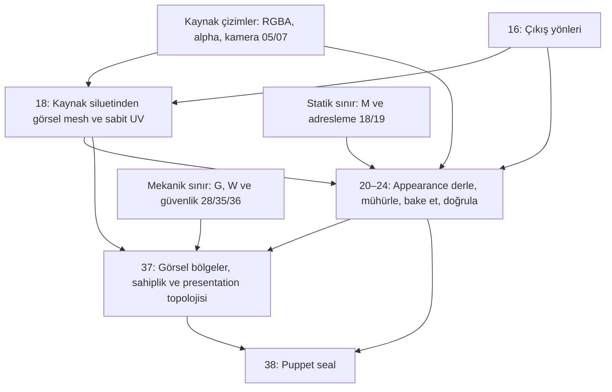
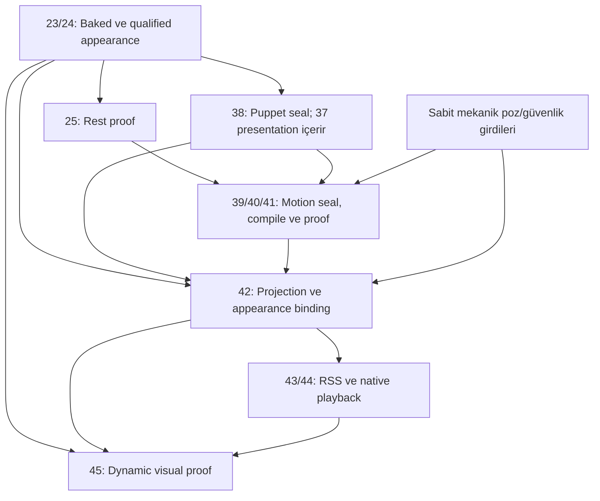
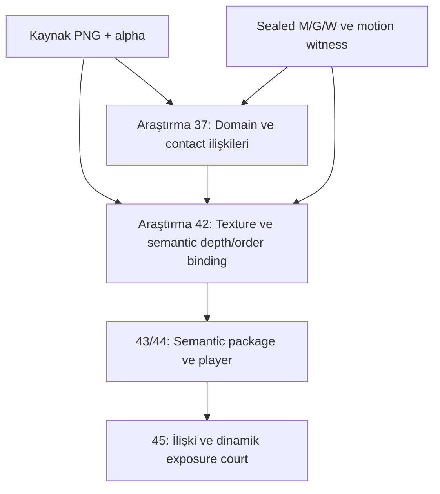
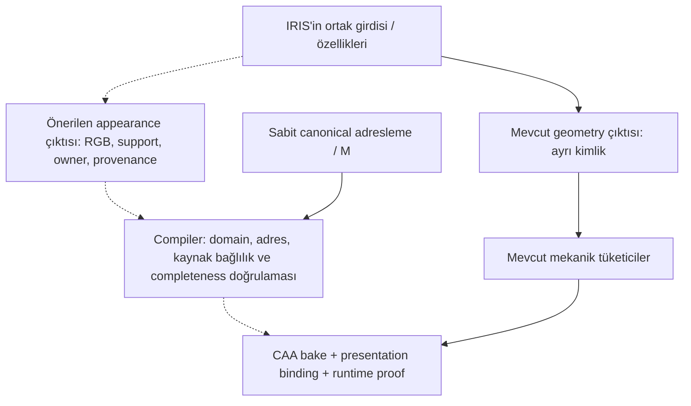

# Görsel hattın bağlantı ve değişiklik haritası

2026-10-09. Mevcut ana hat: `main@1888d91252fdce23843772f3ec0d0e3ddd91b9ae`.
Bu belge ürün PASS'i değildir. IRIS appearance head henüz uygulanmış veya seçilmiş değildir.
PR #66'nın araştırma yolu ana hatta terfi ettirilmemiştir.

## 1. Ana hattaki görüntü kararları

Oklar veri/authority bağımlılığıdır. Mekanik yalnızca görsel hattın aldığı sınır girdisi olarak gösterilir.
Stage numaraları [ana DAG](../../canonical/MAINLINE_EXECUTION_PLAN_V2.json) ile eşleşir.

| Karar / çıktı | Mevcut sahibi ve kod | Görüntüde neyi belirler? |
|---|---|---|
| Görülen alan ve yön | 05/07 kamera/observation, 16 output directions | Hangi kaynak çizimin hangi yönde doğru kabul edildiği; alpha desteği ve projeksiyon |
| Görsel yüzey ve piksel adresi | 18, [v2_architecture.py](../../compiler/realsas_compiler_services/orchestrator/adapters/v2_architecture.py), [visual_mesh_arap_v1.py](../../compiler/realsas_compiler_core/visual_mesh_arap_v1.py) | Her V0–V7 siluetinden triangulation; kaynak rasterına sabit UV. Görsel mesh, mekanik carrier ile aynı mesh olmak zorunda değil |
| Appearance domain ve malzeme | 20 preregister, 21 compile, 22 seal, 23 bake, 24 qualify; [appearance_v2.py](../../compiler/realsas_compiler_services/orchestrator/adapters/appearance_v2.py) | Premultiplied RGBA, kaynak bağlılık/provenance, atlas/UV ve kapsam. Source-owned modda görünen kaynak desteğinin malzemesi korunur |
| Rest görünümü | 25 reference rest proof | Kaynağa göre rest render doğruluğu; hareket sırasında yeni açılan alanın tamamlanmış olduğunu tek başına kanıtlamaz |
| Görsel parçanın sahipliği ve sürekliliği | 37; `product_state_v2.py` → [product_state_legacy_v2.py](../../compiler/realsas_compiler_services/orchestrator/adapters/product_state_legacy_v2.py), [visual_presentation_v1.py](../../compiler/realsas_compiler_core/visual_presentation_v1.py) | Görülen mekanik face sahipliği ve güvenli face komşuluğundan görsel region/seed labels; region içi triangulation. Anatomik parça kimliği veya saklı katman bilgisi değildir |
| Hareketi görsel yüzeye taşıma | 42; [runtime_v2.py](../../compiler/realsas_compiler_services/orchestrator/adapters/runtime_v2.py), `bind_region_visual_vertices_to_mechanical_affine_v1` | Kaynak görsel vertex'lerini mekanik yüzeyin pozlarına bağlar. Ana hattaki operator `REGION_LOCAL_SAFE_MECHANICAL_AFFINE_V1`; dosya adında ARAP geçmesi, bu yolun ARAP kullandığı anlamına gelmez |
| Texture örnekleme, depth ve örtüşme | 42 projection/binding, 43 package, 44 native; [runtime_authority_v2.py](../../compiler/realsas_compiler_core/runtime_authority_v2.py), [runtime_package_v2.py](../../compiler/realsas_compiler_core/runtime_package_v2.py), [native renderer](../../runtime/realsas_cpp/src/runtime_v2_caa_reference.cpp) | Hangi üçgenin/pikselin önde olduğu, texture'ın nasıl örneklendiği ve alpha birleşimi. Salt RGB bu sahiplik kararlarını çözmez |
| Hareketli görüntünün kabulü | 45 dynamic visual proof; 46 closure | Deformasyon, örnekleme, depth belirsizliği ve gözlenmemiş appearance exposure gibi kontroller; mekanik PASS'ten ayrı kabul sınırı |

Stage18 hem mekanik candidate hem görsel substrate yayımlar. Bu iki authority kavramsal olarak ayrıdır; mevcut stage-result kimliği ise paket seviyesindedir. Stage37 daha sonra güvenli deformasyon bölgelerini kurar. Bu yüzden pikselin rest UV'sinin önceden bilinmesi, hareket altında katmanının, deformasyon sahibinin ve saklı malzemesinin de eksiksiz bilindiği anlamına gelmez.

## 2. Runtime'a kadar bağımlılık ve yeniden üretim

**Bugünkü ürün DAG'ında appearance → puppet seal → motion bağımlılığı var.** RGB değişikliği model fit'lerini değiştirmese de motion seal/compile/proof artifact kimliklerini yenileyebilir. “Aynı motion verisi” ile “aynı Stage41 artifact ID” aynı iddia değildir. Motion witness'ın mekanik kanıtını appearance bağımlılığından ayırmak, ayrıca tasarlanıp doğrulanacak bir DAG değişikliğidir; bu platform temizliğinde sessizce yapılmadı.

| Değişiklik | Beklenen ilk etki | Devamında etkilenenler | Sabit kalabilecek sınır / koşul |
|---|---|---|---|
| Yalnız `appearance` manifest girdisi; source/mesh değişmiyor | 20–24 | 25, 37–46 | IRIS/TESSA/AXIS/MIRA, M/G/W qualification; korunacak artifact'lar baseline'a pinlenir |
| Yalnız 21'in semantic parametresi | 21 | 22–25, 37–46 | 20 ve mekanik kol. Ortak `appearance_v2.py` kodunu değiştirmek ise 20–25'in tüm implementation kimliklerini değiştirebilir |
| Yalnız 23 bake parametresi | 23 | 24/25, 37–46 | 20–22 ve mekanik kol; domain/adresleme aynı kalmalı |
| Görsel region, ownership veya binding politikası | 37 veya 42 | 37 değişirse 38–46; 42 değişirse 43–46 | M/G/W aynı olabilir. Görsel topoloji/UV yeniden doğrulanır; yalnız RGB değişikliği diye sunulmaz |
| Native sampling / alpha / depth kuralı | Native implementation ve onu tüketen release stage'leri | Playback, parity ve dynamic proof | Geometri ve model çıktıları; paket sözleşmesi değişirse export da yenilenir |
| Alpha desteği, kaynak bytes veya görsel domain değişiyor | Kaynak seal/observation ve/veya 18/20 | Tüketen DAG closure'ı | Ana hatta 18 ortak paket olduğundan mekanik yeniden qualification/fit gerekmeyeceği peşinen söylenemez |
| M geometrisi/topolojisi gerçekten değişiyor | 18/19 | G, W ve bağlı görsel/mekanik kanıtlar | Salt appearance deneyi değildir; yeni M üzerinde gerekli inference/qualification yapılır |

Tablo mantıksal değişiklikleri gösterir. Gerçek kapsam, release snapshot'ın **transitive implementation closure + policy + parameters + graph/read-set** karşılaştırmasından çıkar. Aynı Python modülündeki iki fonksiyonun ayrı stage olması, dosya kimliklerinin bağımsız olduğu anlamına gelmez. Platform contract'ı bu farkı gizlemez; ilan edilen scope ile gerçek direct changes uyuşmazsa reddeder.

## 3. PR #66'daki araştırma yolunun farkı

[Sabit inceleme](https://github.com/merynz/RealSaS-OPT/blob/0868cfa6cce861034ed61e0afaad9799699ce5bc/docs/presentation/TEXTURE_SEAL_AND_25D_BRIDGE_REVIEW_20261009.md) ve [araştırma diff'i](https://github.com/merynz/RealSaS-OPT/pull/66) tarihî tanı/evidence olarak korunur.

Bu yolun küçük araştırma DAG'ı 37/42/43/44/45'i çalıştırır; sealed mechanics ve motion witness girdilerini kullanır. Appearance binding'i kaynak PNG listesine bağlar; ana hattaki qualified Stage24 complete appearance paketini tüketmez. Kaynak görünür maskesinden kurulan domain'lerde sonradan yapılan contact/depth/draw-order düzeltmesi, çizimde hiç bulunmayan iç yüzey malzemesini yaratmaz.

Bu şema ana hattaki CAA tüketiminin yerine geçmez. V6 evidence run `37933851760`'da iki Attempt da FAILED; sonraki replay'de relation PASS_DIAGNOSTIC ile exposure FAIL_DIAGNOSTIC birlikte görülür. `continue-on-error` nedeniyle yeşil workflow, görsel kabul anlamına gelmemiştir. Bunlar açık appearance boşluğunu açıklayan ölçümlerdir, ürün terfisi değildir.

## 4. Önerilen IRIS RGB çıkışının yeri — henüz bağlı değil

Amaç, mevcut geometriyi sabit tutup appearance üreticisini değiştirebilmek. Aşağıdaki kesik oklar öneridir.

| Öneride erken bilinmesi gereken | Neden gerekir? |
|---|---|
| RGB ve alpha/support ayrı tanımlı olmalı | Renk değişimi ile görünür yüzey/domain değişimini ayırmak için |
| Sabit canonical pixel/texel adresi ve hangi yüzeye/katmana ait olduğu | Mesh'e sarılan texture'ın hareket sırasında başka parçaya taşınmasını önlemek için |
| Görülen kaynak, tamamlanan/saklı yüzey ve belirsizlik provenance'ı | Bilinmeyen bölgeyi kabul edilmiş kaynak malzemesi gibi sunmamak; coverage yetersizse abstain/fail |
| Yönler arası correspondence, katman ve overlap sözleşmesi | Sekiz çizimi tek düz texture'a indirip stil/siluet/line-art kaybetmemek için |
| Geometri ve appearance için ayrı producer/read-set/implementation kimlikleri | RGB head değişince geometry cache'in bozulmaması için. Aynı stage manifest'ine ikinci dosya eklemek tek başına yeterli değil |

Ortak IRIS trunk/checkpoint değişirse geometri etkilenebilir. Geometri çıktısını yeniden inference ederek elde etmek gerekiyorsa, byte/hash eşitliği ayrıca ölçülür; “aynı geometri” varsayımıyla kimlik değişimi görmezden gelinmez. İlk dar deney için geometri artifact'ı pinlenip ayrı appearance producer'ı çalıştırmak daha kolay ölçülebilir bir sınırdır.

RGB head malzemeyi erken üretebilir; deformasyon, contact veya draw order'ın yerine geçmez. ARAP bir görsel deformasyon operator seçeneğidir; saklı yüzeyin malzemesini tamamlayan bir yöntem değildir. Hollow Knight tarzı 2D görüntüyü korumak için source/view-conditioned çizgi, alpha ve siluet korunmalı; tek 3D ışıklandırma/texture çözümü zorunlu kılınmamalı. Bunlar sonraki tasarımın kabul koşullarıdır.

## 5. Causal deneyin platform sınırı

Yeni `research-start.intervention` contract'ı direct stage değişikliklerini önceden ilan eder. Parent Attempt aynı subject ve baseline release'e ait olmalı, tek bir SubjectInput kimliğiyle çalışmış olmalıdır. Girdi role/order/artifact kimlikleri de pinlenir; değişen roller ayrıca `changed_input_roles` ile ilan edilir ve yalnız gerçek tüketicileri/descendants invalidate edilir. Bütün unchanged stage'ler dondurulur; target closure içinde olanlar, başlangıçta kaydedilmiş **aynı qualified artifact ID** ile REUSE edilmelidir. Cache kaybı veya gizli input değişimi yeni inference'a dönüşmez; çalışmadan önce durur.

`INTERVENTION_REUSE_VERIFIED` receipt'i exact artifact ID + semantic SHA, çalışacak stage'ler ve target dışındaki stage'leri ayrı kaydeder. Target dışında kalan bir stage, çalışmadığı için “exact reuse ölçüldü” sayılmaz. Bu kontrol release/read-set sözleşmesinin doğruluğunu veya görsel kaliteyi tek başına kanıtlamaz; [deney protokolü](../platform/CAUSAL_INTERVENTIONS.md) kapsamı ve sınırları açıklar.
