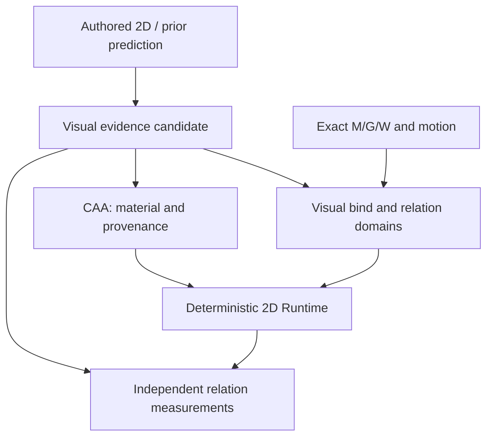

# IRIS appearance research: layered 2D evidence on 3D mechanics

2026-10-10. Status: **SOURCE_INSPECTED__REFERENCE_PRODUCER_AND_BIND_PENDING**.
The user authorizes a real layered 2D reference/prior experiment and subsequent
IRIS appearance research. No model training, new Engine Attempt, released
reference adapter, Knight visual binding or visual qualification is claimed.
The machine-readable proposal is
[`IRIS_APPEARANCE_RESEARCH_V1_20261010.json`](../../canonical/IRIS_APPEARANCE_RESEARCH_V1_20261010.json).

## Authority and source findings

Mechanical mesh, rig, weights, geometry and topology remain 3D. Knight's source
FBX is mechanical truth, not 2D appearance, semantic order or amodal truth.
Use genuine authored 2D art for appearance targets; prior generations remain
predictions until independently evaluated. Observed source pixels can measure
source fidelity without establishing hidden anatomy or semantic ownership.

The existing ArtistIntent Gold Source split was materialized and verified:
219,256,413 bytes, SHA256
`935f7737c123b988ffd0989ed13d673095ff255794bb9bfc17d5bc1dcf3e753e`,
all three part hashes and ZIP CRC pass. The archive has 1,919 entries including
1,739 PNG, 49 SCML, 2 SCON, 2 PSD and 3 XCF files. Counts are files, not
independent characters, topology diversity or training admission.

Input inspection of `P0074_4081c29a/Knights.scml` verified 526/526 project manifest
entries, 53 referenced sprite PNG assets, 11 animations, 90 mainline keys and
1,538 object references. Entity/authored-object addresses identify 18 sprite
owners and four order configurations. No missing sprite references, duplicate
per-key z-indices or declared image-size mismatches were found. The SCML hash is
`662ae40d79ec85a527b655944755e95708f7abd6eb9fadf4e4f7014fa31ca630`.
The two other projects' PSD headers/layer records each contain 18 records.
This is raw inspection; it does not qualify hidden material or validate a renderer.

This 2D Knights drawing is a different character from Quaternius Knight.
Repeated use of one sprite does not merge its distinct authored owners.
Authored IDs are project/entity-local, never automatically Compiler canonical IDs.
The old V3 canonical-frame projection is historical identity supervision, not a
new temporal occlusion, multiview, 3D binding or product qualification.
License/provenance admission for the new learning purpose also remains pending;
an old identity-corpus audit is not an appearance-training admission.

## Proposed producer and consumer boundaries

This is a design, **not** the released product DAG.

Visual evidence must represent stable owners and local fragments, RGBA/alpha,
visible and amodal support, source provenance, local visual addresses and
uncertainty. Interleaving can require several fragments per semantic part;
one global part-depth scalar is not universally sufficient.

The authored reference producer must derive isolated-layer and composite
visibility targets. A complete sprite support is not complete target anatomy.
Missing layers or unknown required-domain cardinality must remain unknown,
not zero obligations. PSD atlas layer order is not scene overlap order.

A separate binder consumes evidence and pinned mechanical artifacts. It must
publish explicit visual-local to mechanical/canonical address mappings,
deformation ownership and relation addresses. Candidate inferred mappings or
manual annotations must be labeled and independently validated. A cross-character
reference retarget is not same-character visual truth.

Required-contact and grip domains, both endpoint addresses and target motion
coverage must be produced explicitly. Authored pivots/parents are not independent
contact or hand/prop truth. CAA must transport completed material onto actual
hidden visual support; merely reading a sidecar consumes no visual samples.
Runtime only consumes qualified artifacts, without inference or generative repair.

Independent consumers measure source fidelity, address round-trip residuals,
per-contact separation, hand/prop residuals, revealed unsupported pixel coverage
and intended occlusion violations. Report exact required-domain coverage and
actual per-layer/sample use. Hash validation alone proves identity, not use.
Mutation checks must detect omitted material, swapped owner, wrong order and
disabled attachment application even when the input artifact hashes remain valid.

## Admission sequence and modularity

1. Review/release the reference producer and its independent measurement
   consumer on main, with explicit raw-input read sets and content pins.
2. Admit the 2D source for the intended research purpose. Extract visibility and
   full-layer targets; qualify their coverage rather than copying old PASS flags.
3. Produce and validate the currently missing mechanical bind and required
   relation domains. Reject unsupported mappings before claiming a Knight render.
4. Execute the bounded experiment through Go agent-context/agent-enter,
   EngineRelease/SubjectInput/Attempt, research-run and agent-exit. Use an explicit
   intervention and exact qualified preserved artifacts when continuing Knight.
5. After reference representation and consumption are measured, train an
   independently versioned IRIS appearance producer against the admitted targets.

No step above has been executed by this source-inspection note. The executable
reference producer/consumer remains to be implemented. The present source lacks
qualified Knight binding, multiview identity, required contact/grip addresses and
target-motion amodal coverage; those are concrete remaining data obligations.

For the initial head experiment, keep geometry artifacts fixed and expose
appearance as a separate producer/output/read-set identity. A changed shared
trunk legitimately invalidates geometry and its consumers; never suppress that
dependency. M/G/W are fixed for this witness, not globally. Dataset/head/model
changes follow ordinary declared DAG invalidation.

Authored IDs/names, graph, transforms, complete layers and order may supervise
teacher targets, but unavailable truth must not enter student inference inputs.
ArtistIntent offers cross-pose identity, not automatically true camera-direction
correspondence or paired 3D binding truth. Additional annotation/data remains
necessary where that supervision cannot be constructed and verified.

## Prior work and novelty hypothesis

[CharacterGen](https://arxiv.org/html/2402.17214v3) reconstructs 3D characters and
textures. Its RGB/features output is not our full owner/fragment/amodal/bind
contract. [See-through](https://arxiv.org/html/2602.03749v1) directly studies
semantic RGBA layers, hidden-region completion and stratified drawing order for
single anime images. These components are not previously unsolved problems.
[Animating Childlike Drawings with 2.5D Character Rigs](https://arxiv.org/html/2502.17866v1)
is adjacent work combining 2D drawing style with 3D motion; that broad idea alone
cannot establish novelty.

The research hypothesis is a persistent, addressed 2D visual representation
bound to 3D mechanics, with independently measured completeness, relation
correctness and actual modular runtime consumption. Whether the method is new
and generalizes requires comparative experiments. No novelty, unseen or product
PASS is issued here.
